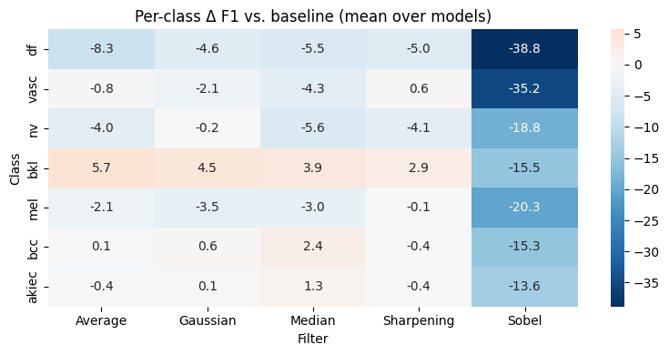

# Lab 02: Does image filtering help or hurt skin lesion classification?

Haider Mushtaq, FA23-BAI-044

In Lab 01 I benchmarked eight pretrained CNNs on the ISIC dataset. ResNet50, DenseNet121 and ResNet101 came out on top. This lab takes those three and asks a simple question: if I run classical filters over the images before training, does the model get better or worse?

I tested five filters (average, Gaussian, median, sharpening, Sobel) against an unfiltered baseline. Three models times six conditions is 18 training runs. Everything else stays fixed so the filter is the only thing that changes.

## What's in here

```
Lab_02/
├── Lab02_Filtering_HAM10000.ipynb   the whole pipeline, with outputs
├── README.md
├── ANSWERS.md                       my answers to the lab questions
└── results/
    ├── comparison_table.csv         the 18-row table the lab asks for
    ├── delta_vs_baseline.csv        how much each filter moved the numbers
    ├── class_sensitivity.csv        which classes react most to filtering
    ├── class_distribution.csv
    ├── summary.txt
    └── figures/                     curves, confusion matrices, comparison plots
```

## Dataset

HAM10000. It has 10,015 dermoscopy images in 7 classes, and the imbalance is brutal: nv alone is over 6,700 images while df has 115.

I didn't use the full thing. 18 runs on 10k images won't finish inside a Kaggle session, so I capped every class at 500. The three small classes (akiec, df, vasc) stay whole. That gives around 2,600 images. The exact per-class and per-split counts get printed in section 2 and saved to `results/class_distribution.csv`.

One thing I had to be careful about: HAM10000 has multiple photos of the same lesion under different `lesion_id`s. If you split randomly, near-identical images end up on both sides of the train/test line and your test accuracy is a lie. I split by lesion so that never happens. Roughly 72/14/14 train/val/test, stratified by class.

## How to run it

I ran this on Kaggle with a P100. It also works on Colab, see below.

Kaggle:

1. Import the notebook
2. Add Input, search `skin-cancer-mnist-ham10000`
3. Turn on GPU and Internet
4. Run all

The dataset path is picked up automatically. Results go into `results.csv` after every single run, so if the session dies halfway you rerun and it skips whatever already finished.

Colab: T4 runtime, add a `KAGGLE_API_TOKEN` secret (key icon in the left sidebar), `!pip install -q thop`, Run all. The notebook reads the token from Secrets and downloads HAM10000 itself. Copy `results.csv` to Drive between sessions because `/content` gets wiped on disconnect.

All 18 runs took a bit over 3 hours.

## Setup I kept fixed

| | |
|---|---|
| Input size | 224 x 224 |
| Where the filter sits | after resize, before augmentation |
| Augmentation (train only) | flips, rotation up to 20 degrees, mild colour jitter |
| Loss | cross-entropy with class weights and 0.1 label smoothing |
| Optimiser | AdamW, lr 1e-4, weight decay 1e-4, cosine decay |
| Epochs | 10 |
| Batch size | 32 |
| Which checkpoint | best validation accuracy |
| Metrics | accuracy, macro precision and recall, weighted F1, macro F1, balanced accuracy, macro AUC |

Filtering happens after the resize on purpose. A 5x5 kernel on a 600px image and a 5x5 kernel on a 224px image are not the same operation. Resizing first means every image sees the same amount of blur.

## The filters

| Filter | How |
|---|---|
| Average | `cv2.blur`, 5x5 |
| Gaussian | `cv2.GaussianBlur`, 5x5, sigma 1.5 |
| Median | `cv2.medianBlur`, size 5 |
| Sharpening | `cv2.filter2D` with the `[[0,-1,0],[-1,5,-1],[0,-1,0]]` kernel |
| Sobel | 3x3 Sobel in x and y, gradient magnitude, scaled to 0 to 255 |

Sobel gives a single grey channel. I copy it into three channels so the pretrained first conv layer still accepts it. Colour gets thrown away, and that's intentional. The Sobel condition is really asking "what happens when the model only gets edges."

## What I found

Full table in `results/comparison_table.csv`. Accuracy and Macro-F1 on the 381-image test set:

| Model | No Filter | Average | Gaussian | Median | Sharpening | Sobel |
|---|---|---|---|---|---|---|
| ResNet50 | 75.33 / 76.41 | 75.59 / 76.71 | **76.90 / 77.90** | 71.92 / 72.78 | 74.54 / 75.44 | 55.12 / 54.46 |
| DenseNet121 | **74.80 / 75.89** | 72.70 / 72.87 | 71.65 / 73.08 | 73.23 / 73.56 | 74.02 / 74.87 | 56.17 / 54.19 |
| ResNet101 | 75.07 / 76.29 | 73.75 / 74.71 | 75.85 / 75.35 | **76.90 / 77.61** | 73.49 / 75.42 | 55.38 / 52.41 |

Bold is the best condition for each model.

The short version:

- **Sobel wrecks everything.** Every model lost around 20 points of accuracy and 22 to 24 points of Macro-F1. Throwing away colour is a bad idea for dermoscopy. Vascular lesions, which are basically diagnosed by colour, dropped 35 points of F1.
- **Smoothing and sharpening are small effects, and the sign depends on the model.** Gaussian helped ResNet50 by 1.5 points, hurt DenseNet121 by 2.8. Median helped ResNet101 by 1.3, hurt ResNet50 by 3.6. Sharpening was slightly negative everywhere.
- **DenseNet121 never improved.** Baseline was its best run. My guess is that dense connectivity reuses early features everywhere, so texture lost at the input stays lost.
- **Excluding Sobel, filtering cost 1.17 points of Macro-F1 on average.** Twelve of the fifteen filtered runs were worse than their baseline. Three were better, and there's no way to know which pairing works without running it.
- **bkl was the one class that liked smoothing.** It gained 3 to 6 points under every non-Sobel filter. Those images carry a lot of surface scale and hair, so blur acts as denoising there. Melanoma lost 2 to 3.5 points under every smoothing filter, which is the class you'd least want to lose recall on.

The full reasoning is in [ANSWERS.md](ANSWERS.md).



## Things I'd change with more time

Ten epochs is on the short side. K-fold instead of a single split would make the comparisons more trustworthy. And the filter parameters (kernel size, sigma) were picked once and never tuned, so a gentler Gaussian might tell a different story.
