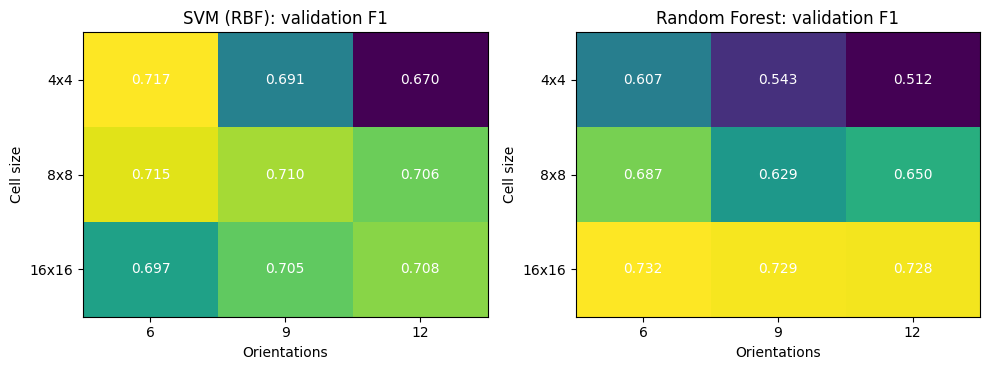
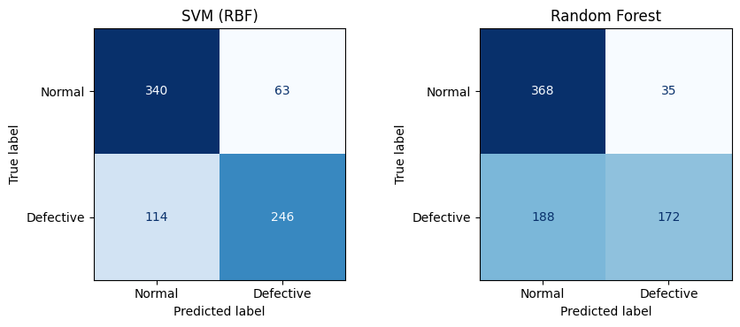
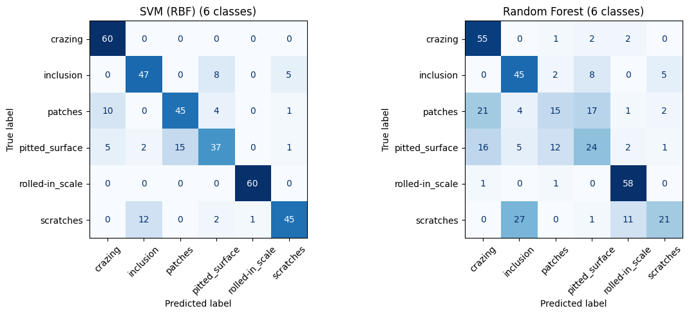

# HOG-Based Industrial Defect Detection and Classification

**Haider Mushtaq**
Computer Vision Laboratory 05
COMSATS University Islamabad, Wah Campus

## Abstract

This study evaluates a Histogram of Oriented Gradients (HOG) pipeline for automated inspection of steel surfaces in the NEU-DET dataset. The notebook constructs a binary task by extracting defect-centered 100 × 100 crops and non-overlapping normal crops from images with XML annotations, and also evaluates the original six-class defect recognition task. Images are converted to grayscale and resized to 128 × 128 before HOG extraction. An RBF support-vector machine (SVM) and a class-weighted random forest are compared. HOG cell size and orientation count are selected on a grouped validation split from the training data. On the saved 763-window binary evaluation set, the SVM achieved 76.80% accuracy and 0.7354 F1, compared with 70.77% accuracy and 0.6067 F1 for the random forest. On the 360-image six-class validation set, SVM achieved 81.67% accuracy and 0.8130 macro-F1, substantially above the random forest's 60.56% accuracy and 0.5755 macro-F1. These results support HOG with an RBF-SVM as a useful lightweight baseline; the evaluation remains limited to one dataset split, and robustness and deployment outputs were not saved in the committed run.

**Keywords:** industrial inspection, surface defect detection, HOG, support-vector machine, random forest, NEU-DET

## 1. Introduction

Surface inspection is an important quality-control step in manufacturing. Manual inspection can be slow and inconsistent, while an automated vision system can apply the same decision rule to each inspected product. This laboratory studies a conventional feature-based pipeline: grayscale preprocessing, HOG descriptor extraction, and supervised classification.

HOG represents local edge directions and their spatial distribution. Unlike a learned CNN representation, its features are fixed by the descriptor settings. This makes HOG relatively easy to inspect and pair with standard classifiers, while placing more responsibility on feature and classifier choices. The experiment compares an RBF-SVM with a random forest and evaluates both binary normal-versus-defective detection and the six defect categories supplied by NEU-DET.

## 2. Industrial Application

The intended use is a first-pass quality-control screen for steel surfaces. In the binary task, a sample is classified as normal or defective. In the proposed product-level decision module, a large surface is scanned with overlapping 100 × 100 windows at a stride of 50 pixels. If any window's estimated defect probability reaches 0.5, the product is rejected; otherwise, it is accepted. When a large image is rejected, a second classifier predicts one of the six defect types.

This decision rule is a prototype. The notebook's committed outputs do not include measurements from the product-level scan or the real-time webcam simulation, so no production-level sensitivity, false-reject rate, or throughput claim is made.

## 3. Dataset Description

The notebook uses the public NEU steel surface defect dataset distributed through Kaggle. Its saved dataset inspection found 1,800 grayscale images and matching XML annotations. The six classes are crazing, inclusion, patches, pitted surface, rolled-in scale, and scratches. Each class contains 300 images: 240 training and 60 validation images, giving 1,440 training and 360 validation images overall.

NEU-DET contains defect examples rather than a separate clean-product class. For binary classification, the notebook uses XML bounding boxes to extract one defective crop centered on the largest annotated defect in each image. It also searches the same image for up to two 100 × 100 windows that do not overlap any annotated defect box. The saved data construction produced 3,110 training crops (1,440 defective and 1,670 normal) and 763 validation crops (360 defective and 403 normal).

The six-class task uses the full images and the dataset's provided train/validation split. No independent third test split is recorded; therefore, the notebook's `valid` partition is the final evaluation partition reported here.

## 4. Image Preprocessing and HOG Features

Images are read in grayscale and resized to 128 × 128 pixels using area interpolation. HOG uses L2-Hys block normalization and 2 × 2 cells per block. The parameter experiment varies cell sizes of 4 × 4, 8 × 8, and 16 × 16 pixels and orientation counts of 6, 9, and 12. The selected configuration is the one with the best SVM F1 on a validation subset drawn only from the training crops. A `GroupShuffleSplit` groups crops by source image so crops from one original image do not cross the internal training/validation boundary.

The selected configuration was a 4 × 4 cell size with 6 orientations, producing a 23,064-element feature vector. The final binary models are then fitted on the full binary training set and evaluated on the held-out dataset validation partition.

*Figure 1. Accuracy and F1 across cell-size and orientation settings on the internal grouped validation subset.*

## 5. Classification Methodology

Two classifiers are compared. The SVM uses an RBF kernel, `C = 10`, `gamma = scale`, and balanced class weights. The random forest contains 200 trees, uses balanced class weights, and fixes its random seed at 42. For the binary task, precision, recall, and F1 refer to the defective class; accuracy is computed over both classes. For the six-class task, precision, recall, and F1 are macro averages.

For the six-class run, the final reported model uses the same HOG configuration selected by binary SVM validation. The classifier is fitted on the 1,440 training images and evaluated on all 360 validation images.

## 6. Experimental Setup

| Setting | Value |
|---|---|
| Dataset | NEU steel surface defect dataset |
| Image dimensions for HOG | 128 × 128 grayscale |
| HOG cell sizes tested | 4 × 4, 8 × 8, 16 × 16 |
| HOG orientations tested | 6, 9, 12 |
| Selected HOG configuration | 4 × 4 cells, 6 orientations |
| Classifiers | RBF-SVM; 200-tree random forest |
| Binary evaluation samples | 763 crops: 403 normal, 360 defective |
| Multiclass evaluation samples | 360 full images, 60 per class |
| Random seed | 42 |

## 7. Results

### 7.1 HOG parameter selection

The SVM's highest validation F1 in the nine-setting sweep was 0.7166 for 4 × 4 cells and 6 orientations. This setting generated 23,064 features per image. The random forest's highest displayed validation F1 was 0.7320 at 16 × 16 cells and 6 orientations, but the notebook selected the configuration using SVM F1, as specified by its selection rule. The complete table is in [`results/hog_parameter_sweep.csv`](results/hog_parameter_sweep.csv).

### 7.2 Binary normal-versus-defective classification

| Model | Accuracy | Defective precision | Defective recall | Defective F1 |
|---|---:|---:|---:|---:|
| RBF-SVM | 76.80% | 79.61% | 68.33% | 73.54% |
| Random forest | 70.77% | 83.09% | 47.78% | 60.67% |

The SVM had higher accuracy and F1. The random forest's higher defective precision came with substantially lower defective recall: it identified fewer than half of the defective evaluation crops. The SVM's defective recall of 68.33% also means that a meaningful share of defective crops was missed, which would need attention in a safety- or quality-critical deployment.

*Figure 2. Confusion matrices for the binary evaluation.*

### 7.3 Six-class defect classification

| Model | Accuracy | Macro precision | Macro recall | Macro-F1 |
|---|---:|---:|---:|---:|
| RBF-SVM | 81.67% | 81.58% | 81.67% | 81.30% |
| Random forest | 60.56% | 60.00% | 60.56% | 57.55% |

The SVM led on all four reported metrics. Its per-class report shows strongest performance on rolled-in scale (F1 0.992) and weakest performance on pitted surface (F1 0.667). The six-class confusion matrices are shown below and the numeric metrics are available in [`results/multiclass_classification.csv`](results/multiclass_classification.csv).

*Figure 3. Confusion matrices for the six-class evaluation.*

### 7.4 Robustness analysis

The notebook defines tests for darker and brighter images, a positive brightness shift, Gaussian noise at two standard deviations, rotations of 10° and 30°, and Gaussian blur at two strengths. The committed notebook has no saved output for this section, so the accuracy and F1 changes cannot be reported from the available run. These conditions are an experimental plan, not measured findings in this paper.

## 8. Discussion

Across both tasks, the RBF-SVM outperformed the random forest in accuracy and F1. The binary random forest favored normal-crop recall (91.3%) over defective-crop recall (47.8%), while the SVM had a more balanced class-specific result (84.4% normal recall and 68.3% defective recall). This distinction matters for inspection: a system that misses defective material can be less useful even if its overall accuracy appears reasonable.

On the six-class task, the SVM reached 81.67% accuracy on a balanced validation partition. Performance was not uniform across categories. Rolled-in scale was recognized reliably in this run, while pitted surface had lower recall (61.7%). The confusion matrix should be used alongside the aggregate scores when considering where the classifier may need additional training data or a different representation.

The parameter sweep shows a trade-off between descriptor size and validation performance. The selected 4 × 4, 6-orientation SVM descriptor contains 23,064 values per image; larger cells reduce the descriptor size but did not achieve a higher SVM F1 in this sweep. The selected setting is specific to this dataset and split and should not be treated as a universally optimal HOG configuration.

## 9. Industrial Deployment and Limitations

The notebook's quality-control rule scans overlapping windows and rejects a product if any window exceeds the defect-probability threshold. This favors catching localized defects but can increase false rejections as the number of scanned windows grows. The threshold should be calibrated against the relative costs of missed defects and unnecessary rejects, using a production-representative dataset. The webcam prototype is a bonus demonstration and has no saved benchmark output in the repository.

The main limitations are the single fixed dataset split, synthetic normal windows cropped from defective source images, and the lack of saved robustness and product-level evaluation results. A normal crop can contain unannotated damage, and crop-level metrics do not directly measure whole-product performance. The validation partition is also used as the final reported evaluation, so these figures should not be interpreted as an unbiased estimate from an independent test set. The experiment does not report repeated seeds, confidence intervals, calibration, or performance on a separate production line.

## 10. Conclusion

The saved experiment demonstrates a compact HOG-based defect-classification baseline on NEU-DET. With 4 × 4 cells and 6 orientations, the RBF-SVM achieved 76.80% binary accuracy and 73.54% defective-class F1, and reached 81.67% accuracy with 81.30% macro-F1 on six defect classes. It outperformed the random forest on accuracy and F1 in both tasks. These results support the SVM as the stronger of the two tested classifiers for this run, while its defective-class recall and the missing robustness and product-level measurements remain important limits to address before deployment.

## References

1. K. Song and Y. Yan, “A noise robust method based on completed local binary patterns for hot-rolled steel strip surface defects,” *Applied Surface Science*, vol. 285, pp. 858–864, 2013. Dataset reference and access: [NEU steel surface defect dataset](https://www.kaggle.com/datasets/sovitrath/neu-steel-surface-defect-detect-trainvalid-split).
2. N. Dalal and B. Triggs, “Histograms of oriented gradients for human detection,” in *Proceedings of the IEEE Computer Society Conference on Computer Vision and Pattern Recognition*, 2005, pp. 886–893.
3. C. Cortes and V. Vapnik, “Support-vector networks,” *Machine Learning*, vol. 20, no. 3, pp. 273–297, 1995.
4. L. Breiman, “Random forests,” *Machine Learning*, vol. 45, no. 1, pp. 5–32, 2001.
